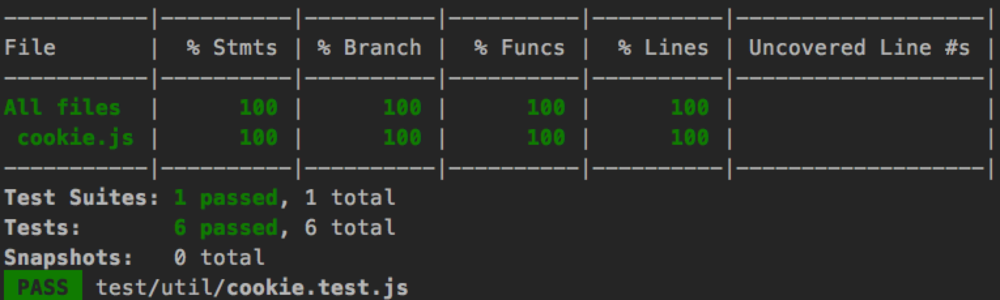

1、测试文件的命名规则如下：
 
     1）与src目录同级有test目录，保存单元测试的文件
     2）延续src下的命名加.test.js
         eg: src下有util/cookie.js,则在test目录下有util/cookie.test.js
 
2、单元测试的文档学习地址：https://jestjs.io/docs/zh-Hans/getting-started
		
	重点看以下部分
	1）https://jestjs.io/docs/zh-Hans/using-matchers
	2）https://jestjs.io/docs/zh-Hans/asynchronous

3、单元测试编写完毕后怎么运行
	
	npm test
	
4、对单元测试的要求：
 
     1）查看单测的覆盖率是否为100%，代码行数执行是否有未执行到的行数
     2）如果覆盖率未100%，代码行数全部执行，进行单测文件的提交即可，如下图为符合条件
   
     	
